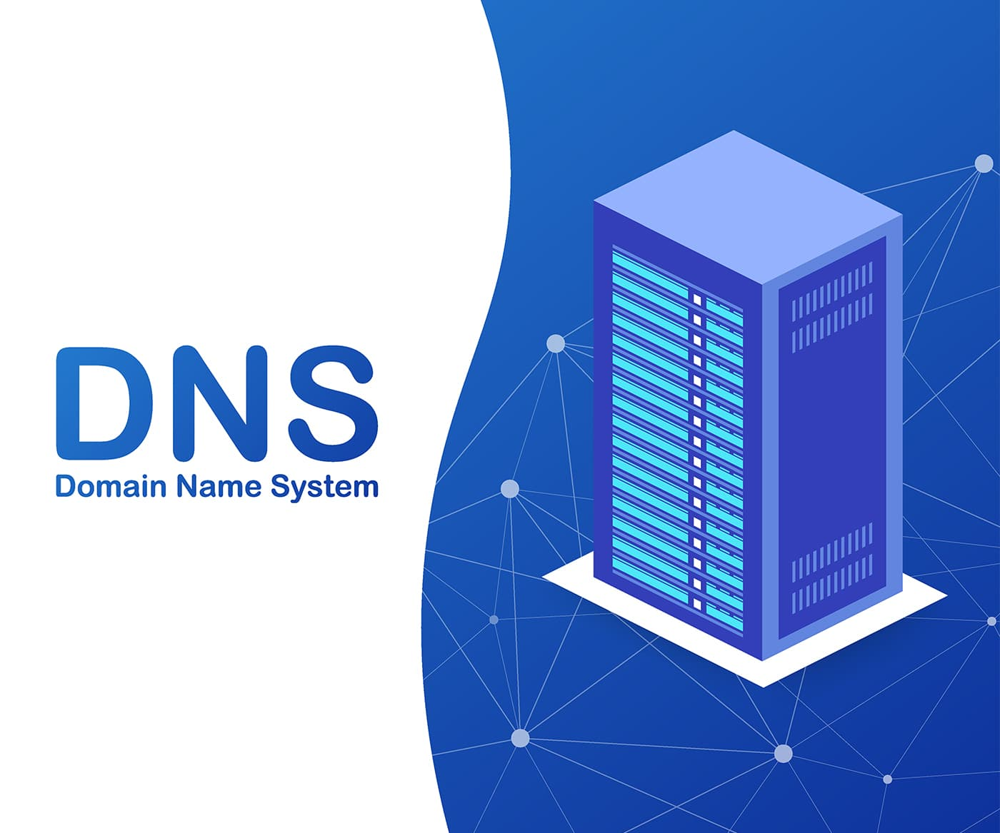

  

<link rel="stylesheet" type='text/css' href="https://cdn.jsdelivr.net/gh/devicons/devicon@latest/devicon.min.css" />

# Hola, mi nombre es Leidy

Llevo 4 años en el ámbito de la informática mas enfocado en la administración de sistemas informáticos y redes, tengo el Grado medio de Sistemas microinformáticos y redes, además de que actualmente estoy en proceso de terminarl el Grado superior de Administracion de sistemas informaticos en red.

He aprendido una gran cantidad de herramientas bastante reconocidas e importantes en este sector tanto en programación, ciberseguridad y administración de una red de sistemas informáticos.

------

### Tecnologias que ulizido en mi día a día:

  - 🐉 SO: Kali linux y kali Purple linux, Windows server y Windows 10-11, Ubuntu Server y Ubuntu desktop,Debian Server ! 
  - 🛠️ Herramientas: Odoo, Wordpress, MySQL Workbench, XAMPP, Nessus, CLARA, Shodan, Systevo, Lynis, Git, GitKraken, GitHub, Virtual box, Visual Studios Code...

------

## Proyectos Destacados
<table>
<tr>
<td width="50%">
 
<h3 align="center">Router-Firewall</h3>

Esta práctica consiste en crear un router con una máquina debian sin interfaz gráfica.

                                                                                      
</td>

<td width="50%">
<h3 align="center">DHCP</h3>

Esta práctica consiste en crear tres servidores DHCP en máquinas debian sin interfaz gráfica que son: DHCP, DHCP-Relay, DHCP-Failover  

                                                             
</table>                                                                                 

 

<table>
<tr>
<td width="50%">
<h3 align="center">DNS</h3>
 

 
 

Esta práctica consiste en crear un servidor DNS en una máquina debian sin interfaz gráfica que resolver los nombres de dominio.

                                                                                  
</td>       

<td width="50%">
<h3 align="center">FTP</h3>

 
 

Esta práctica consiste en crear un servidor FTP en una máquina debian sin interfaz gráfica que permiten la transferencia de archivos de unos dispositivos a otros.

                                                                                      
</td>  
</table>                                                                                 

 

------
<h3 align="left">Actividad:</h3>
<table>
<tr>
  <td>

  

  </td>
  <td>

  

  </td>
</tr>
  </table>
------
<h3 align="left">Lenguajes y Herramientas:</h3>
<table>
    <tr>
        <td style="font-weight: bold; padding-right: 10px; vertical-align: center; border: none;">Cloud Computing:</td>
        <td></td>
    </tr>
    <tr>
        <td style="font-weight: bold; padding-right: 10px; vertical-align: center; border: none;">Bases de datos:</td>
        <td></td>
    </tr>
    <tr>
        <td style="font-weight: bold; padding-right: 10px; vertical-align: center; border: none;">Control de versiones:</td>
        <td></td>
    </tr>
    <tr>
        <td style="font-weight: bold; padding-right: 10px; vertical-align: center; border: none;">IDEs:</td>
        <td></td>
    </tr>
    <tr>
        <td style="font-weight: bold; padding-right: 10px; vertical-align: center;">Frontend:</td>
        <td></td>
    </tr>
    <tr>
        <td style="font-weight: bold; padding-right: 10px; vertical-align: center; border: none;">Backend:</td>
        <td></td>
    </tr>
    <tr>
        <td style="font-weight: bold; padding-right: 10px; vertical-align: center; border: none;">Sistemas operativos:</td>
        <td></td>
    </tr>
    <tr>
        <td style="font-weight: bold; padding-right: 10px; vertical-align: center; border: none;">Otras herramientas:</td>
        <td></td>
    </tr>
</table>
